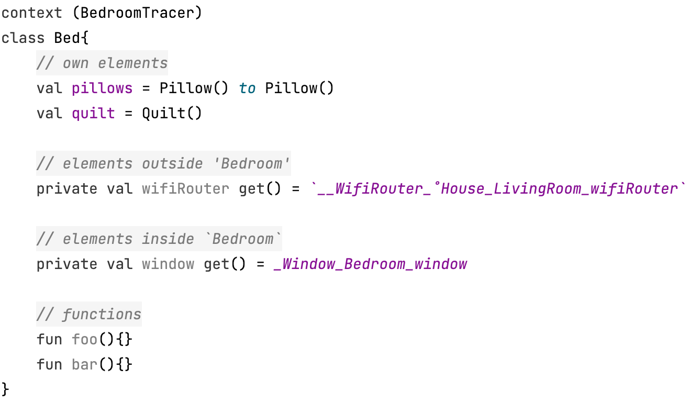

# Suggested code order
  

---

# Lazy
Use `lazy` when you need to construct some objects based on common injected elements.   


---

# Override style
  

- Put it at the bottom to look better.
- Use `get() =` instead of `=` to avoid `null` when [passing args](#pass-args).
---

# Pass args


<p align="center">↓</p>

  

---
# Tracer interface conversion

This would be needless in the expected new syntax.

# Compatibility with KSP
`Tracer` is compatible with `ksp 1.7.0-1.0.6` at least. Although mostly it works well with `ksp`,
you'd better try to make your `ksp plugin` in a high stable version to avoid bugs. 

# Elements built times display

<br>

# Java, K/N & K/JS
`Java`, `Kotlin/Native` and `Kotlin/JS` are not supported, because they lack `context receiver` 
which is essential in this tool. But it's absolutely safe to reference `Java classes and functions` 
in Kotlin files.

# Internally generated
Makes all generated code internal, which is commonly used in submodules.
  

# Partial traceable super types
  

  ---

  
  <br>

# Trace ends    
Elements or their type classes with features below are considered as trace ends, meaning 
they are never traced insides. Like classes with `Tracer.Root`, they should be designed independently 
and avoid being exploring too insides.
- `Tracer.Root`, `Tracer.Nodes` or `Tracer.Tip`
- Interface, enum, object 
- Nullable
- Foreign (from other modules, generated code, or Java files)
- Rebuilt symbols 
  - Constructor is not single and empty.   
  - Generic
  - Abstract / open  
  
  

---
No `_Int` appears.  
  

# Type alias
Alias types are always converted to its actual types.

---


---


&nbsp;&nbsp;

[//]: # (## Var)

[//]: # (Source code)

[//]: # (```kotlin)

[//]: # (@Tracer.Root)

[//]: # (class VarSample {)

[//]: # (  var x = 1)

[//]: # (})

[//]: # (```)

[//]: # ()
[//]: # (Generated code)

[//]: # (```)

[//]: # (public var VarSampleTracer.`_Int_VarSample_x` )

[//]: # (  inline get&#40;&#41; = `_VarSample`.`x` as Int)

[//]: # (  inline set&#40;value&#41;{ `_VarSample`.`x` = value })

[//]: # (```)

[//]: # ()
[//]: # (Injection sample)

[//]: # (```kotlin )

[//]: # (context &#40;VarSampleTracer&#41;)

[//]: # (class Foo{)

[//]: # (  private var x: Int)

[//]: # (      get&#40;&#41; = _Int_VarSample_x)

[//]: # (      set&#40;value&#41; { _Int_VarSample_x = value }  )

[//]: # (})

[//]: # (```  )

[//]: # ()
[//]: # ()

[//]: # (Expected reference after official support.)

[//]: # (  ```kotlin)

[//]: # (  context &#40;VarSampleTracer&#41;)

[//]: # (  class Foo{)

[//]: # (    private var _x: Int by this@VarSampleTracer::_Int_VarSample_x)

[//]: # (  })

[//]: # (  ```)

[//]: # ()