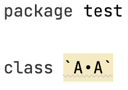
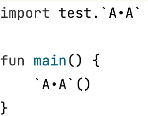

# Failed code inspection 
Few generated types fail code inspection, mostly because of the imperfect official type. For 
the example below  


Therefore, I cast them in generated code.    


However, some types are incorrectly inferred and error shows even cast, whereas I 
forget those examples unfortunately. Use another source type or annotate them with `Tracer.Omit`. 

# Inaccurate `*` in typealias 
`*` in alias types are all shifted first and then converted, which, however, may be inaccurate.  
  For source code
  ```kotlin
  interface A<T: Iterable<String>> 

  interface B<T: List<CharSequence>>

  typealias MyTypeAlias<T> = Pair<A<T>, B<T>>
  ```
  The real bound is `List<String>`, which is only one of those difficult cases. With `Tracer`, 
  `MyTypeAlias<*>` is converted to `Pair<A<*>, B<*>>` first, and 
  `Pair<A<out Iterable<String>>, B<out List<CharSequence>>>` next.   
  
  This could be fixed if one day kotlin requires generic bounds for typealias like  
  `typealias MyTypeAlias<T: List<String>> = Pair<A<T>, B<T>>`
  

# Never use special characters in class names
Class `A•A` is imported as ``` `A•A` ``` because of special symbols which, however, are 
hard to adapt. At present, `Tracer` doesn't support this import style in the 
generated code. 

---



---

