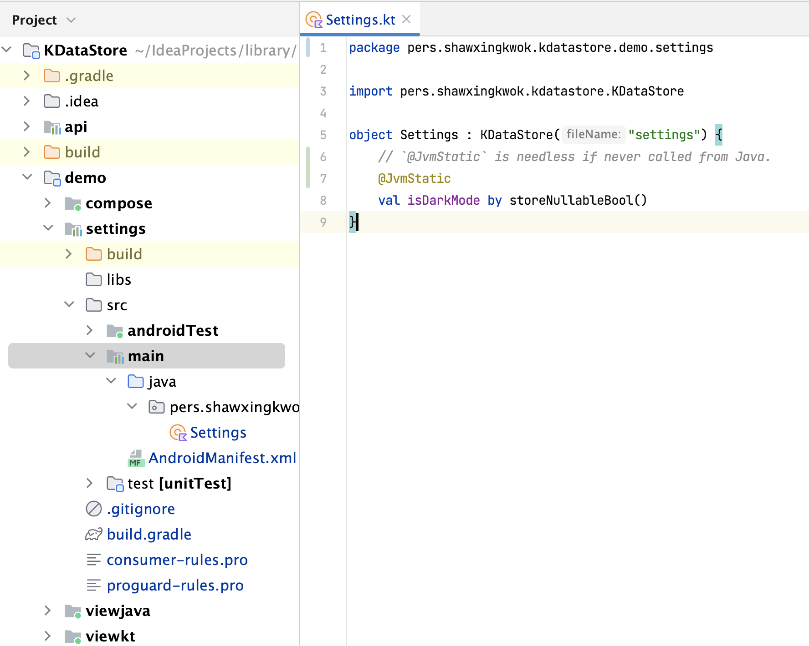
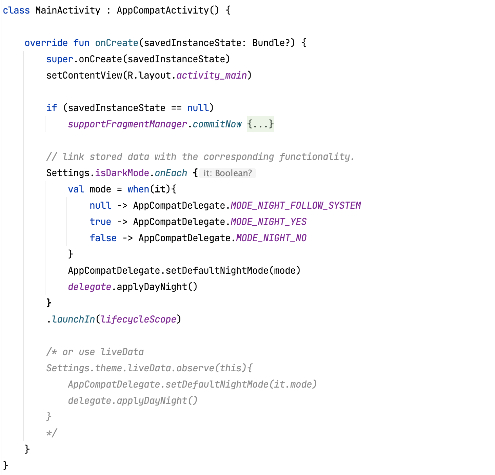
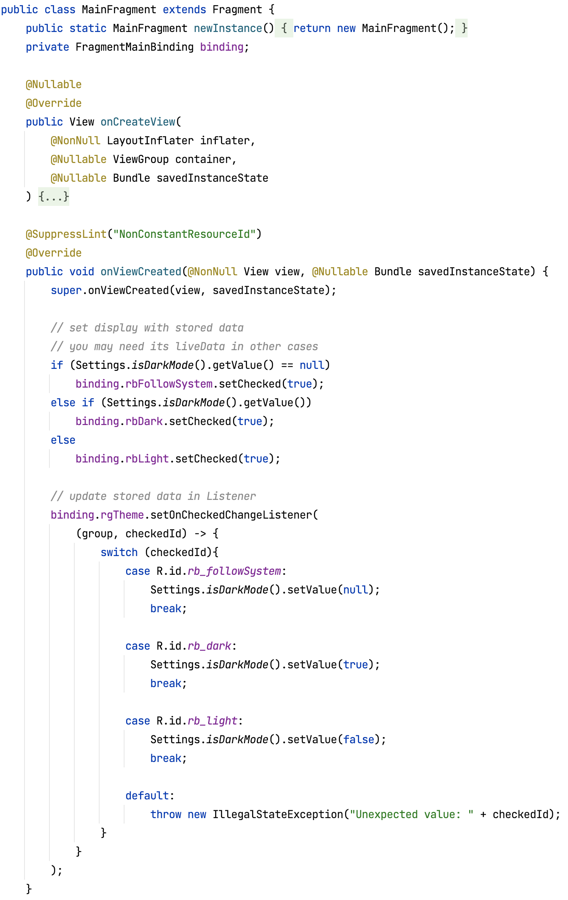
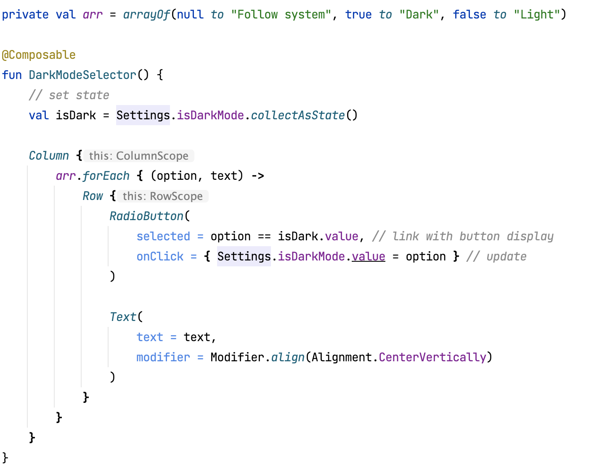
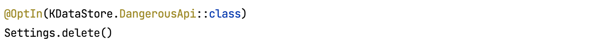


这份中文版本主要为初期的宣传考虑，其他作品并不会写中文版本和 Java 扩展。


# KDataStore

## 本地快捷存储方案对比

<table>
<tr>
    <th></th>
    <th>SharedPreferences</th>
    <th>MMKV</th>
    <th>DataStore</th>
    <th>KDataStore</th>
</tr>

<tr>
    <td>机制</td>
    <td>
        同步读写
        <br><br>
        <span style="color:red">commit 堵塞1.4ms</span>
        <br> apply 不堵塞，<span style="color:red">但不知道是否成功写入磁盘。</span>
        <br><br><span style="color:red">不论是否成功写入，都更新内存，通知监听</span>
    </td>
    <td> 
        先读取到系统级别的内存
        <br><br><span style="color: green; ">同步不堵塞读写</span>
        <br><br>后台定时异步写入磁盘 
    </td>
    <td> 异步读写，写入成功后更新内存。<br><br>通过 Flow 异步观察。 响应时间 2.1 ms </td>
    <td> 
        基于 DataStore 
        <br><br> 先读取到应用级别的内存 
        <br><br> <span style="color: green; ">同步不堵塞读写</span>
        <br><br>数据更新时异步写入磁盘，包括备份文件。 
    </td>
</tr>
    
<tr>
    <td>启动时间(ms)</td>
    <td>2.2</td>
    <td>3.2</td>
    <td>49(异步)</td>
    <td><span style="color: red; ">13</span>, 文件显著增加时影响不大</td>
</tr>

<tr>
    <td>读取中遇 IOException</td>
    <td>返回默认值</td>
    <td>返回默认值</td>
    <td rowspan="3">自行 catch 处理</td>
    <td><span style="color: green; ">从备份文件中取</span></td>
</tr>

<tr>
    <td>写入中遇 IOException</td>
    <td>用未写入该数据的备份文件替换，且不再写入。<br><br> 如用 commit, 可通过返回的 false 获悉</td>
    <td rowspan="2">后续校验数据，尝试恢复，不行则删除。</td>
    <td><span style="color: green; ">记录，下次启动时从备份文件中更新</span></td>
</tr>

<tr>
    <td> Corruption<br>Exception </td>
    <td> <span style="color: red; ">用空文件替换</span> </td>
    <td> <span style="color: green; ">通过复制备份文件数据处理</span> </td>
</tr>

<tr>
    <td>多进程共享</td>
    <td>自行封装入 ContentResolver</td>
    <td> <span style="color: green; ">支持</span> </td>
    <td>处于 alpha 阶段</td>
    <td>DataStore 正式支持之后</td>
</tr>

<tr>
    <td>加密</td>
    <td>自行封装</td>
    <td><span style="color: green; ">支持</span></td>
    <td>自行封装</td>
    <td> <span style="color: green; ">支持</span> </td>
</tr>

<tr>
    <td>类型安全</td>
    <td>否</td>
    <td>否</td>
    <td><span style="color: green; ">是</span></td>
    <td><span style="color: green; ">是</span></td>
</tr>

<tr>
    <td>除常见基本类型, String, Set&lt;String&gt; 外的类型支持</td>
    <td></td>
    <td> <span style="color: green; ">Parcelable</span></td>
    <td><span style="color: green; ">自定义</span><br>但需放在独立的 DataStore 中</td>
    <td> <span style="color: green; "> enum <br> Serializable(java/kotlin) 自定义 <br> 且均可空</span></td>
</tr>

<tr>
    <td>额外优点</td>
    <td></td>
    <td> 
        <span style="color: green; ">ANR前一刻更新的数据不会丢失</span> 
    </td>
    <td></td>
    <td>
        <span style="color: green; "> 建模简单，调用方便 </span>
    </td>
</tr>

<tr>
    <td>额外缺点</td>
    <td></td>
    <td><span style="color: red; ">断电或者系统崩溃后容易丢失很多数据</span></td>
    <td></td>
    <td><span style="color: red; "> 比较新，</span> 但仅 300 多行代码，相对稳定。
        <br><br> <span style="color: red; ">建模时只能使用 Kotlin, </span> 只会 Java 的同学需稍掌握一点 Kotlin 知识。
    </td>
</tr>
</table>

以上测试结果采用 30 份 7(key length) * 20(value length) 的 String 数据，机型魅族18s。代码在[源码](https://github.com/ShawxingKwok/KDataStore/archive/refs/heads/master.zip)中。


关于其他地方的存储方案对比分析，绝大多数都有严重错误。
官网相对准确，但也很片面。如想探究，建议自己测试并查阅源码。


## 基础用法
用 Dark theme 举例 

### UI 展示
<video height="200" controls>
  <source src="../effect.mov" type="video/mp4">
</video>

### 建模
单独分出的模型模块中, 常见命名为 `settings`,（如果不采纳，后续的 `settings` 命名则一并更改）
<div style="border:1px solid black; padding-left:10px;">
    
</div>

### 调用

在其他模块中调用 



<div style="border:1px solid black; padding-left:10px;">
    
</div>
<br>
<div style="border:1px solid black; padding-left:10px;">
    
</div>



<div style="border:1px solid black; padding-left:10px;">
    
</div>
<br>
<div style="border:1px solid black; padding-left:10px;">
    
</div>



<div style="border:1px solid black; padding-left:10px;">
    
</div>
<br>
<div style="border:1px solid black; padding-left:10px;">
    
</div>




## 配置

配置相应 `build.gradle`, 或可直接看[源码](https://github.com/ShawxingKwok/KDataStore/archive/refs/heads/master.zip)中的 demo。

### 根目录 


```
plugins{
    ...
    id 'org.jetbrains.kotlin.plugin.serialization' version "$version_kt" apply false
}
```



```
plugins{
    ...
    id ("org.jetbrains.kotlin.plugin.serialization") version "$version_kt" apply false
}
```



### 模型模块
单独分出一个 module, 常见命名为 `settings`, （如果不采纳，后续的 `settings` 命名则一并更改）
language 选择 **kotlin** 而非 java。



```
plugins {
    ...
    id 'kotlinx-serialization'
}

dependencies {
    ...
    implementation 'org.jetbrains.kotlinx:kotlinx-serialization-json:1.5.0'
    implementation 'io.github.shawxingkwok:kt-util:1.0.0'
    implementation 'io.github.shawxingkwok:android-kdatastore:1.0.0'
}
```


```
plugins {
    ...
    id ("kotlinx-serialization")
}

dependencies {
    ...
    implementation ("org.jetbrains.kotlinx:kotlinx-serialization-json:1.5.0")
    implementation ("io.github.shawxingkwok:kt-util:1.0.0")
    implementation ("io.github.shawxingkwok:android-kdatastore:1.0.0")
}
```



### 调用方 





```groovy
tasks.withType(org.jetbrains.kotlin.gradle.tasks.KotlinCompile).configureEach{
    kotlinOptions.freeCompilerArgs += "-Xcontext-receivers"
}

dependencies {
    ...
    implementation 'io.github.shawxingkwok:android-util-view:1.0.0'
    implementation 'io.github.shawxingkwok:android-kdatastore:1.0.0'
    implementation project(':settings') 
}
```



```groovy
dependencies{
    ...
    implementation 'io.github.shawxingkwok:android-kdatastore:1.0.0'
    implementation project(':settings') 
}
```







```kotlin
tasks.withType<org.jetbrains.kotlin.gradle.tasks.KotlinCompile>().configureEach{
    kotlinOptions.freeCompilerArgs += "-Xcontext-receivers"
}

dependencies {
    ...
    implementation ("io.github.shawxingkwok:android-util-view:1.0.0")
    implementation ("io.github.shawxingkwok:android-kdatastore:1.0.0")
    implementation (project(":settings")) 
}
```



```kotlin
dependencies{
    ...
    implementation ("io.github.shawxingkwok:android-kdatastore:1.0.0")
    implementation (project(":settings")) 
}
```





## 类型支持
### 常见类型
`Boolean`, `Int`, `Long`, `Float`, `Double`, `String`, `Enum`, `Serializable` 
<div style="border:1px solid black; padding-left:10px;">
    
</div>

### Kt Serializable
Kotlin 官方出的序列化工具，速度比 `Java Serializable` 快两倍多，且支持多平台。
基本类型，`Pair`, `Triple`, 还有常用容器类型如 `List`, `Set` 的默认实现均可视为 `Kotlin Serializable`。

[//]: # (It's an official platform-neutral data conversion.)
<div style="border:1px solid black; padding-left:10px;">
    
</div>

### 自定义
只需实现和 `Serializable` 之间转换与恢复的函数即可。暂未找到比较适合自定义的例子。
<div style="border:1px solid black; padding-left:10px;">
    
</div>

### 可空
此时对默认值限制为 `null`，以上类型都有对应。这非常实用，尤其是存储对象时。
<div style="border:1px solid black; padding-left:10px;">
    
</div>

## 迁移
`KDataStore` 内置 `appContext` 供你获取其他存储仓库，如 `SharedPreferences`, `MMKV`, `DataStore` 等。
<div style="border:1px solid black; padding-left:10px;">
    
</div>

### Exists


```
if(Settings.exists()) 
    ...
```


```
if(Settings.INSTANCE.exists())
    ...
```



如果以后需要从`KDataStore`迁移到别处，这可以帮助你判断文件是否存在。

## 可选参数
<div style="border:1px solid black; padding-left:10px;">
    
</div>

### 文件名
如果只有一个 `KDataStore`, 建议命名为 `settings` 或 `preferences`，相应的 class name(首字母大写), module name 亦是如此。

### 加密
`KDataStore`提供了加密功能接口和一个 AES 实现。
<div style="border:1px solid black; padding-left:10px;">
    
</div>

Android 在 api 29 版本开始引入了沙盒机制，实现了数据隔离，相对已经很安全了。你们可视版本要求、信息的重要程度来选择
是否存储在本地、是否加密、以什么协议加密。

## 其他细节
### 删除/全部重置


<div style="border:1px solid black; padding-left:10px;">
    
</div>


<div style="border:1px solid black; padding-left:10px;">
    
</div>


等效于“全部重置”, 可在中途使用，在下次更新值时再次生成文件。
<br>
警告以防止误用，并无任何异常风险。

### 局部重置
比如重置声明过的 `age`


```
Settings.age.reset()
```


```
Settings.getAge().reset();
```



### 快速启动
如果你介意这点启动时间。可先行在 `Application` 中异步启动 `Settings`, 或者第一次启动 `Settings` 的时候采用异步。

## <a href="https://github.com/ShawxingKwok/KDataStore" target="_blank">GitHub repo</a>