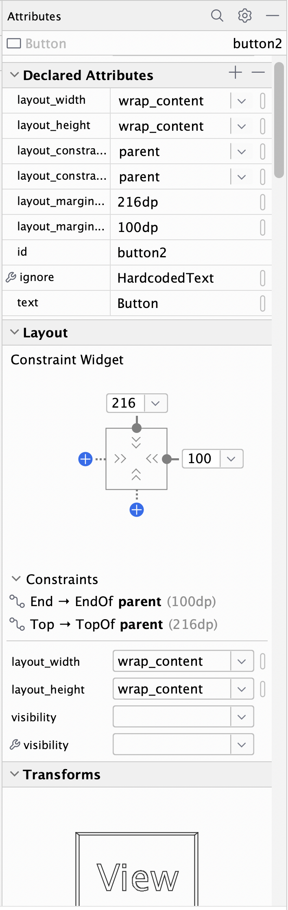
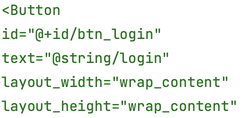

# Abstract
The expected implementation requires official assistance to design visual operation interfaces.
Goals are as below.
1. A new UI design tool based on those traditional e.g. PhotoShop, Figma, which outputs view source code 
from designers directly usable by developers without inserting any code, including visually designed animations. 

2. A new imperative UI system with Kotlin multiplatform in which each component from designers has its corresponding Kotlin code. 
All developers need to do is bind `view` with dynamic data in Kt files, which could be optimized by . 

If this could be implemented, it could reduce most code as well as negotiations between designers and developers, which 
is revolutionary without doubt.

Some plugins (e.g. Zeplin) do a similar work but only support basic features and generates several versions of output code 
for each platform.

The Figma plugin `relay` is more powerful but outputs `Compose` which contains serious problems as blow. 
1. Works couple between designers and developers.
2. The recombination mechanism of `Compose` inevitably reconstructs massive objects, resulting in its low upper 
performance limit.


Below are suggestions those simplify designs and help parse. Meanwhile, the generated layout
code is the quickest in measurements. Many expected effects are explained with abstract words. Hope you to be patient.


# All positions reference to borders or dividers
All the traditional layouts are deprecated, e.g. frame, linear, relative, and constraint.
Each component is added to the panel with default position limits. For example, a `TextView` is added to the top-right 
area, and the panel which contains no dividers shows its distances to top and right borders. (This is by default and editable.)
Besides, the distances are directly editable with mouse or keyboard in the panel. The two blue arrows should be 
removed.  
  

# Relative positions are displayed but actually excluded
Now I add a `button` at the top-right area near the added `TextView`. It's also linked to top and right borders by 
default. And the relative distance tagged with my red line should be also displayed, but excluded in the background 
source code.   
  

# Independent components
Components can't be constrained with each other, but multi-select-editable. Components from another file are seen as 
a single component.  
  

# New attributes panel
The right-side attributes panel is replaced with source code of the selected component exception positions.  

  

    
  

  
 -> to manual code like 

  

    
  

There popups a progressbar when you type some attributes needing visual modifications like rotation and alpha.

# Custom shapes and animations
These are designed as in `PhotoShop` and `Figma`, but embeddable in mainstream systems and bound-able with foreign Kotlin 
data. It sounds difficult but is doable for a qualified official team. Even if it's not realized, this proposal is 
significant enough to beat other patterns. 